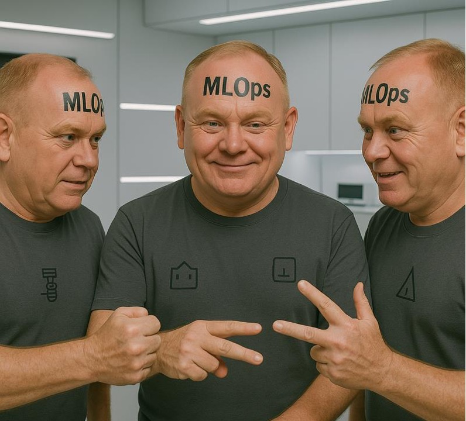

# ✋ Rock-Paper-Scissors with Hand Gestures  

An Interactive ML-Powered Game Using Real-Time Hand Recognition

👉 [Try the App](https://choepi.github.io/Praise_MLOps_Project/)

---

## 🎯 Project Overview

This project demonstrates a complete machine learning lifecycle—**from data collection to real-time inference**—through a Rock-Paper-Scissors game controlled by **hand gestures captured via webcam**. Designed for edge deployment, the model runs entirely in-browser, with no need for a server or backend.

---

## 🧠 How It Works

1. **Live Input**: Captures webcam video using HTML & JavaScript.
2. **Hand Detection**: Uses MediaPipe to extract 3D hand landmarks.
3. **Gesture Classification**: ONNX model infers Rock, Paper, or Scissors based on keypoints.
4. **Game Logic**: Plays against a computer opponent using standard rules.
5. **User Feedback**: Visual output displayed instantly, with emoji reactions and scorekeeping.

---

## 💡 Key Features

- ⚡ **Real-time browser-based inference** (no server needed)
- 🤖 **Compact ONNX model**, optimized for edge use
- 🎮 **Interactive UI** using HTML, JS, and emojis
- 📸 **Feedback loop**: Users flag misclassifications to aid retraining
- 🛠 **End-to-end MLOps**: Clear model pipeline with CI/CD

---

## 🛠 Tech Stack

| Component        | Technology                             |
|------------------|-----------------------------------------|
| Interface        | HTML, CSS, JavaScript                  |
| Vision & ML      | MediaPipe Hands, ONNX Runtime (Web)    |
| Training         | Python, scikit-learn, wandb            |
| Data Labeling    | Roboflow                               |
| Cloud Storage    | Cloudinary                             |
| Testing & CI     | Black, PyTest, GitHub Actions          |

---

## 📦 Deployment

- **Web**: Deployed via [GitHub Pages](https://choepi.github.io/Praise_MLOps_Project/)
- **Edge-Optimized**: ONNX model runs directly in-browser
- **No Dependencies**: Only requires a webcam and modern browser

---

## 🔁 Feedback & Retraining

- Misclassified gestures can be flagged with a single click
- Images are uploaded to **Cloudinary** for review
- Labeled via **Roboflow** and used to periodically **retrain the model**
- Retrained models are exported to **ONNX** and pushed to the live app

---

## 🧪 Testing & CI/CD

- `black` used for consistent formatting
- `pytest` unit tests for gesture classification and game logic
- **GitHub Actions** for automatic linting and testing on pull requests

---

## 🎓 Why This Project?

This app is a compact demonstration of:

- A full **MLOps pipeline** from scratch
- **Edge AI deployment** using ONNX in-browser
- Engaging **human-computer interaction**
- Balanced focus on **accuracy, speed, and usability**

It combines real-world computer vision with a fun interface—ideal for both educational and professional demonstrations.

---
